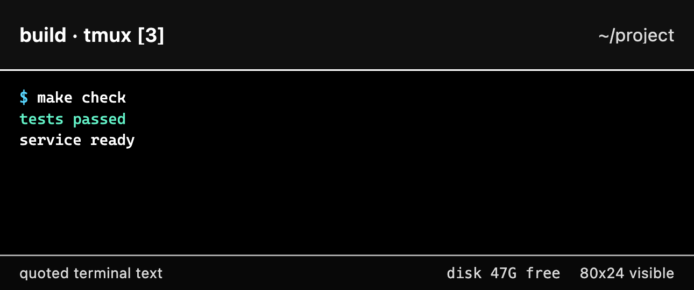

<p align="center">
  
</p>

<h1 align="center">Engram</h1>

<p align="center">
  <strong>Remote tmux, rendered as a quiet signal.</strong>
</p>

Engram is a single-user Telegram control surface for local tmux sessions. It
creates or attaches to tmux windows, routes Telegram messages into panes, and
presents each pane as one stable, pinned Telegram anchor. That anchor can be a
conversational guide or an exact terminal image rendered locally by Chromium.

**Why tmux?** Its mature, narrow command surface has effectively crystallized.
Very little API drift is expected, which makes tmux an unusually durable
substrate for a small remote-work tool.

## Two options are available

| Conversational guide | Chromium |
| --- | --- |
| **Experience:** the selected model conveys the bounded terminal frame as compact, natural conversation.<br><br>**Pros:** quick to absorb across many sessions; plain language can make dense output legible.<br><br>**Cons:** a model can misunderstand the pane; raw bounded terminal text leaves the machine.<br><br>**Dependencies:** Anthropic Haiku 4.5 or OpenAI Luna, selected with `LLM_PROVIDER`, plus that provider's API key and network access. Chromium is optional and enables `🖼️ View` plus `/mode snapshot`. | **Experience:** Chromium renders the same bounded frame as an iPhone-sized, ANSI-preserving terminal image.<br><br>**Pros:** literal and deterministic; no model interpretation is required.<br><br>**Cons:** exact terminal content is uploaded to Telegram; rendering uses more local CPU and each frame is denser to inspect.<br><br>**Dependencies:** a local Chromium-compatible executable, optionally selected with `ENGRAM_SNAPSHOT_BROWSER`. A configured guide provider is optional and enables `🗣️ Talk` plus `/mode guide`. |

`ENGRAM_ANCHOR_MODE` is the startup fallback when no usable persisted choice
exists. The selected guide is available when configured; Chromium is locally probed.
`/mode guide` and `/mode snapshot` begin migrating the live anchors and persist
that choice across restarts.

## First Run

### 1. Install prerequisites

You need:

- Linux or macOS
- Go 1.22 or newer
- tmux 3.2 or newer, Git, Make, and curl
- A Telegram account
- For **guide mode**, either an Anthropic API key with access to Claude Haiku
  4.5 or an OpenAI API key with access to Luna; Chromium is optional and
  enables the `🖼️ View` button
- For automatic **voice transcription**, an OpenAI API key with access to
  `gpt-4o-transcribe`, independent of the selected guide provider; without it,
  voice replies can remain local files
- For **Chromium mode**, a Chromium-compatible executable; Engram prefers a
  dedicated headless shell. On macOS, automatic detection deliberately excludes
  desktop Chrome and Chromium applications so background snapshots do not
  trigger their privacy-sensitive application behavior. Set
  `ENGRAM_SNAPSHOT_BROWSER` explicitly to opt into another executable. A
  configured guide provider is optional and enables `🗣️`

Linux with a systemd user session is the supported service installation. macOS
is compile-checked and runs manually in the foreground; Engram does not install
a launchd service.

On macOS, use the standalone `chrome-headless-shell` published through
[Chrome for Testing](https://googlechromelabs.github.io/chrome-for-testing/).
Put the executable on `PATH` or set its absolute path in
`ENGRAM_SNAPSHOT_BROWSER`. Engram does not download or update the browser.

Clone and enter the repository:

```sh
git clone https://github.com/idolum-ai/engram.git
cd engram
```

### 2. Create the Telegram bot

1. Open the verified `@BotFather` account in Telegram.
2. Send `/newbot` and follow its prompts.
3. Keep the returned token private. It controls the bot.
4. Open a direct message with the new bot and send `/start`.

Before Engram starts polling, retrieve that DM from the official Telegram Bot
API. This keeps the token out of shell history and the `curl` argument list:

```bash
read -rsp "Bot token: " BOT_TOKEN; printf '\n'
printf 'url = "https://api.telegram.org/bot%s/getUpdates"\n' "$BOT_TOKEN" \
  | curl --silent --show-error --config -
unset BOT_TOKEN
```

In the JSON response, use the integer at `message.from.id` for the update whose
`message.chat.type` is `private`. Do not use `update_id` or the bot's own ID.
The response also contains your DM text, so do not paste it into an issue.

### 3. Configure Engram

Create the protected runtime config:

```sh
install -d -m 0700 "$HOME/.engram"
install -m 0600 .env.example "$HOME/.engram/.env"
${EDITOR:-vi} "$HOME/.engram/.env"
```

Upgrades safely tighten an existing owner-controlled `ENGRAM_HOME` to mode
`0700`. Engram still rejects a foreign-owned, non-directory, or symlinked home.

Set the two base values and choose one anchor mode:

```dotenv
TELEGRAM_BOT_TOKEN=the-token-from-BotFather
TELEGRAM_ALLOWED_USER_ID=the-message.from.id-integer
ENGRAM_ANCHOR_MODE=guide
LLM_PROVIDER=anthropic
ANTHROPIC_API_KEY=your-Anthropic-key
```

To use OpenAI Luna instead, set `LLM_PROVIDER=openai` and
`OPENAI_API_KEY=your-OpenAI-key`. Provider selection is startup configuration;
restart Engram after changing it.

Voice replies default to `VOICE_INPUT_MODE=path`: Engram retains the OGG in its
private attachment store and sends one `(voice message: /absolute/path.ogg)`
input to the pane. Set `VOICE_INPUT_MODE=transcribe` with an `OPENAI_API_KEY` to
send the audio once to `gpt-4o-transcribe` and deliver one `(transcribed) ...`
input instead. A standalone voice note remains an ordinary saved attachment.
Changing the voice mode requires a restart.

For Chromium anchors instead:

```dotenv
TELEGRAM_BOT_TOKEN=the-token-from-BotFather
TELEGRAM_ALLOWED_USER_ID=the-message.from.id-integer
ENGRAM_ANCHOR_MODE=snapshot
```

Leave `TELEGRAM_CHAT_ID` empty for DM-only use. Engram then uses the allowed
user ID as the private chat ID. Never commit or post the completed env file.

### 4. Validate without network calls

Both commands load and validate the config without calling Telegram or the
selected model provider and without starting polling. `dry-start` also creates and opens the
local state surface.

```sh
go run ./cmd/engram preflight --env "$HOME/.engram/.env"
go run ./cmd/engram dry-start --env "$HOME/.engram/.env"
```

Confirm that each command ends with `status: ok`, that `tmux` is not reported as
`missing`, and that the displayed user and chat IDs are your private DM IDs.

### 5. Start Engram

On Linux, install the binary and systemd user service:

```sh
make install-service PREFIX="$HOME/.local"
systemctl --user --no-pager --full status engram.service
```

On macOS, install and run it in a terminal instead:

```sh
make install PREFIX="$HOME/.local"
"$HOME/.local/bin/engram" run --env "$HOME/.engram/.env"
```

Only one Engram process may poll a configured bot/user/chat tuple, and only one
process may own an `ENGRAM_HOME`. Do not run a foreground copy while the systemd
service is active.

### 6. Verify the first session

In the bot DM, send:

```text
/new pwd
```

Engram creates a tmux window, runs `pwd`, and replies with an editable session
anchor. In guide mode, bounded pane text is sent to the selected provider. In
Chromium mode, an exact image of the pane is sent to Telegram. Review the
privacy boundaries below before running commands that may print secrets.

When a tracked pane is confidently identified as the specifically tested Codex
CLI version, Engram removes recognized Codex interface chrome before guide
rendering and adds a deterministic line such as
`Codex · gpt-5.6-sol · high · working` to the card. The adapter currently
supports `codex-cli 0.144.5` and `0.144.6`. Other versions and uncertain layouts
use the ordinary terminal path unchanged; raw views and snapshots always remain
literal. When Codex reports its tested fast mode, the deterministic line retains
that state as `Codex · gpt-5.6-sol · high · fast · working`.

## Configuration

`.env.example` is the complete configuration surface. The env file is a simple
`KEY=VALUE` file and must be a regular file with no group or other permissions.

| Setting | Default | Required | Purpose |
| --- | --- | --- | --- |
| `TELEGRAM_BOT_TOKEN` | none | yes, secret | Token issued by `@BotFather`. Treat it as access to the Engram control channel. |
| `TELEGRAM_API_BASE` | `https://api.telegram.org` | no | Telegram Bot API server root. Engram appends `/bot<token>` and `/file/bot<token>`. HTTP is accepted for local servers but exposes credentials and content in transit. |
| `TELEGRAM_ALLOWED_USER_ID` | none | yes | The one Telegram user ID allowed to issue commands. |
| `TELEGRAM_CHAT_ID` | allowed user ID | no | The one allowed chat. Leave empty for a private DM; group operation is unsupported. |
| `TELEGRAM_POLL_TIMEOUT_SECONDS` | `50` | no | Positive Telegram long-poll timeout in seconds. |
| `ENGRAM_ANCHOR_MODE` | `guide` | no | Startup presentation and fallback: conversational `guide` or Chromium `snapshot`. A valid runtime `/mode` choice is persisted in state v9. |
| `LLM_PROVIDER` | `anthropic` | when enabling a guide | `anthropic` for Haiku 4.5 or `openai` for Luna. Only the selected provider is used. Changing it requires a restart. |
| `ANTHROPIC_API_KEY` | none | when selecting Anthropic, secret | Credential for one-pass Haiku rendering. |
| `ANTHROPIC_MODEL` | `claude-haiku-4-5-20251001` | no | Haiku model ID; the `claude-haiku-4-5` alias is also accepted. |
| `OPENAI_API_KEY` | none | when selecting OpenAI or transcription, secret | Credential for one-pass Luna rendering and, when explicitly selected, voice transcription. |
| `OPENAI_MODEL` | `gpt-5.6-luna` | no | Luna model ID. Other OpenAI models are not admitted by this release. |
| `VOICE_INPUT_MODE` | `path` | no | Replied voice-note handling: retain locally and send its absolute `path`, or `transcribe` through OpenAI. Changing it requires a restart. |
| `OPENAI_TRANSCRIPTION_MODEL` | `gpt-4o-transcribe` | no | Assessed one-shot speech-to-text model used only by `VOICE_INPUT_MODE=transcribe`. Other transcription models are not admitted by this release. |
| `ENGRAM_HOME` | `~/.engram` | no | State, remembered input templates, audit log, and process-lock directory. |
| `ENGRAM_WORKDIR` | `~` | no | Starting directory for new tmux sessions and windows. |
| `ENGRAM_TMUX_SESSION` | first existing session, otherwise `engram-<chat-id>` | no | Forces one exact tmux session name and creates it when absent. `:` and `.` are unsupported because tmux canonicalizes them. |
| `ENGRAM_SNAPSHOT_BROWSER` | auto-detected headless shell, with Linux browser fallbacks | when enabling snapshots | Executable name or absolute path used for live or on-demand terminal images. macOS auto-detection accepts dedicated headless executables only; an explicit value may opt into a desktop browser. |
| `ENGRAM_SNAPSHOT_THEME` | `terminal` | no | Live and on-demand snapshot colors: faithful `terminal`, accessible `contrast-dark`, or accessible `contrast-light`. |
| `ENGRAM_SNAPSHOT_STATUS_COMMAND` | none | no | Trusted local shell command whose sanitized one-line stdout occupies a bounded snapshot-footer slot. It runs only while an image is already being rendered, from the pane directory when available. |
| `ENGRAM_ATTACHMENT_SOFT_MAX_BYTES` | `16777216` | no | Incoming attachment soft limit. An exact SHA-256 bypass may authorize up to the 20 MiB cloud Bot API hard limit and available disk. |

`make run` uses `~/.engram/.env` by default. For a protected local config at a
different path, override it explicitly:

```sh
chmod 600 "$PWD/.env"
make run ENGRAM_ENV="$PWD/.env"
```

The repository ignores only the root `.env`; prefer `~/.engram/.env`, and never
place alternate secret files in the checkout.

### Local snapshot status

Snapshot footers can carry one small fact computed by the host without teaching
Engram about operating-system-specific status providers. For example, this
portable command displays the free space on the filesystem containing the
pane's current directory:

```env
ENGRAM_SNAPSHOT_STATUS_COMMAND=df -kP . | awk 'END {printf "disk %.1fG free\n", $4 / 1048576}'
```



The example image uses synthetic terminal text, paths, and capacity rather than
host data.

The value is a trusted local `/bin/sh` command from the protected Engram env
file; terminal text, Telegram messages, and model output can never set it.
Engram runs it only after a snapshot render has already been selected, with a
500 ms deadline, bounded stdout, discarded stderr, and a minimal environment
that excludes configured API keys and the Telegram token. Nonzero exits,
timeouts, empty output, and output requiring secret redaction are omitted
without failing the image. Whitespace and terminal control sequences are
removed, and the renderer—not configuration—deterministically limits the
footer slot so provenance and dimensions retain priority. Status changes alone
do not trigger automatic Telegram edits; the next terminal-driven or manual
render picks up the current value.

## Data Flow / Privacy

Engram deliberately connects a private chat, a local shell, and an external
model API. Compromise of the authorized Telegram account can become shell
access for the configured local user. A stolen bot token can expose or disrupt
the bot channel and must be revoked immediately.

- **Telegram:** Engram long-polls the Bot API for messages and attachments, then
  sends messages, rotates and pins live anchors, edits retired anchors, and
  sends requested files, remembered-template exports, and terminal snapshot
  photos back to the configured DM.
  Telegram receives command text, summaries, terminal image snapshots, `/raw`,
  `/dump`, `/logs`, `/templates export`, and `/download` results sent through the bot.
  In Chromium mode, every changed anchor frame is an exact, unredacted terminal
  image sent automatically to Telegram at most once every ten seconds.
- **tmux and local processes:** Authorized messages can create windows and send
  literal shell input or key presses. Engram-created windows use tmux's global
  `default-size`, matching detached tmux operation even when the selected session
  has a much larger attached client; explicitly attached panes retain their
  existing geometry. tmux owns terminal history and continues running when
  Engram stops unless a window is explicitly closed. A process in
  a nested environment may emit a visible upstream record; the outer Engram
  observes it through the same bounded capture and may notify the Telegram DM.
- **Local snapshot browser:** In guide mode, tapping `🖼️ View` renders an on-demand
  image when Chromium passed startup readiness. In snapshot mode, the renderer
  produces the canonical live anchor whenever its capture changes. Engram
  renders a frame capped at 64 ANSI-preserving rows into a full-bleed PNG at 3x
  density and removes the private HTML, browser profile, and PNG after delivery.
  Narrow frames use a `1290×2796` portrait canvas. Wide terminal rows soft-wrap
  at a readable 100-column viewport and the canvas grows vertically so no
  captured columns are discarded; Telegram can zoom the resulting photo. No
  snapshot content is sent to a model provider. The two
  contrast themes use a color-vision-safe ANSI palette, remove opacity-based
  dim text, and correct low-contrast terminal colors to at least a 4.5:1
  contrast ratio.
  When guide mode and Chromium are both available, the conversational anchor is
  one photo card: a compact evidence crop appears above bounded guide prose in
  the same canonical Telegram message. The selected model identifies short
  verbatim excerpts in its existing request; Engram requires them to occur
  uniquely in both the model's cleaned input and physical terminal rows, adds
  up to two context rows without crossing a blank terminal-block boundary, and
  highlights the matched rows. The footer calls these
  quoted terminal text rather than implying semantic verification. If a model
  excerpt cannot be admitted, Engram deterministically shows the last changed
  on-screen physical-row region from the last accepted frame, then a bounded
  physical paragraph related lexically to the summary (favoring visible links),
  or the current terminal tail. Each crop labels
  its provenance. If styled rows contain a configured secret or cannot be
  aligned safely, Engram renders the bounded tail as redacted plain text. A
  truly empty terminal uses a quiet guide-only frame so the prose remains the
  focus. Compact crops preserve physical row boundaries through the 96-column
  mobile readability limit, shrinking the font only as far as 7px. Genuinely
  wider rows use a disclosed 96-column soft-wrap fallback rather than silently
  clipping text. Crops account for tabs, wide and combining characters,
  preserve inherited terminal styling, and enforce the accessible contrast
  floor. Context stops at blank terminal-block boundaries so unrelated
  neighboring output and passive composer chrome do not enter the card.
  Highlights cover the selected physical row or every disclosed wrapped
  fragment of a wider row. The message ID,
  pin, controls, and reply route do not change.
  Every media anchor also offers `📄 Raw`, which returns the exact delivered
  snapshot frame or the complete unwrapped selected guide rows as a bounded plain UTF-8 text attachment for
  screen readers or exact inspection. It does not recapture a newer terminal
  state on click.
- **Conversational guide:** Guide anchors start from the same frame as Chromium
  and send its joined logical text, capped at 64 rows, in one non-streaming request.
  Recognized upstream records, the trailing model-status footer, and a small
  allowlist of paired Codex placeholder prompts are omitted from model evidence
  but remain in screenshots and raw captures. Every request contains the
  complete current semantic evidence;
  aligned requests may also carry prior prose and deterministic changed,
  removed, and neighboring lines as attention hints. There is no model history,
  no second request, and no prior Telegram input supplied as model context. A
  private evidence trailer is removed before delivery and can only select a
  uniquely matched compact Chromium crop; it is never accepted as terminal
  truth.
  Completed model prose is deterministically bounded to 180 words before
  delivery.
  `LLM_PROVIDER` selects Anthropic Haiku 4.5 or OpenAI Luna; both receive the
  same prompt and bounded evidence. In snapshot mode, tapping `🗣️ Talk` makes the
  same one-off request and sends its conversational result as a reply without
  replacing the photo anchor. Captures are not credential-redacted before they
  are sent.
- **Voice input:** A Telegram voice note replying to a session's latest
  routable message uses the same guarded paste-plus-Enter path as text replies.
  In default `path` mode, Engram retains the OGG and attachment metadata in its
  private artifact store and sends its absolute path to the terminal. In
  explicit `transcribe` mode, it sends a temporary OGG once to OpenAI's
  non-streaming `gpt-4o-transcribe` endpoint, normalizes the response to one
  bounded control-free line, prefixes `(transcribed)`, and removes the audio;
  transcript text is not persisted. A stale reply, changed tmux identity, or
  transcription failure sends no input. Engram never silently crosses from
  transcription to path delivery after an error. After successful delivery,
  Engram replies with the normalized transcript so the user can verify what
  reached the pane.
- **Local state and logs:** `ENGRAM_HOME` contains `state.json`,
  `templates.json`, `audit.jsonl`, one rotated `audit.jsonl.1`, and lock files.
  `templates.json` stores exact user-authored input bodies in plaintext with
  mode `0600`. Each audit file is capped at
  4 MiB and individual records are capped at 64 KiB. State includes Telegram
  identifiers, session metadata, capture hashes, bounded upstream record IDs,
  retry deadlines, latest
  reply aliases, conversational renderings, and selected anchor mode. Raw
  terminal captures and upstream payloads remain in process
  memory for rendering but are omitted from `state.json`.
  Files are created with private permissions, but anyone with access to the
  host account can read them.
- **Attachments and generated files:** Engram prefers
  `$XDG_RUNTIME_DIR/engram` when that directory is private and writable;
  otherwise it uses `engram-<uid>` under the system temporary directory.
  Incoming Telegram documents are saved in its `attachments` subdirectory.
  `/raw`, `/dump`, `/logs`, and command metadata create files in the private
  runtime root. These files are not automatically removed by uninstall and may
  remain until manual or operating-system cleanup.
  On-demand snapshot and voice-transcription intermediates are exceptions:
  they are removed after delivery or failure.
- **Downloads:** `/download <absolute-path>` opens a local regular file, copies
  that opened file into a private bounded snapshot, and uploads the snapshot to
  Telegram. It rejects symlinks, but it is still an intentional
  file-exfiltration command. Review the exact path before sending it.

Audit events redact configured credentials and common token, key, password, and
private-key patterns. Delivered upstream-signal payloads may remain in that
redacted audit history. `/logs` applies the same pattern-based redaction to a
  bounded audit tail. Model-derived prose receives the same best-effort redaction
before persistence or Telegram delivery. Redaction can miss unfamiliar secrets
or sensitive prose. It does not
sanitize raw terminal captures, `/raw`, `/dump`, `/download`, incoming
attachments, existing Telegram history, or captures sent to the selected provider.
`state.json` still contains sensitive metadata and derived terminal content.
Treat all terminal transcripts and diagnostic artifacts as sensitive and review
them before sharing.

## Linux Lifecycle

Install or replace the binary from a source checkout:

```sh
make install PREFIX="$HOME/.local"
```

For a published release, choose a version from the GitHub Releases page, inspect
the installer at that same version tag, then run it. The installer verifies
the archive checksum and embedded version before atomically replacing the
binary:

```sh
version=v0.1.0 # replace with the release you reviewed
curl -fsSLo /tmp/engram-install-release.sh \
  "https://raw.githubusercontent.com/idolum-ai/engram/${version}/scripts/install-release.sh"
less /tmp/engram-install-release.sh
bash /tmp/engram-install-release.sh "${version}"
```

Release installation does not modify `~/.engram`, create a service, or restart
one. A source checkout is still required for the initial `.env` and systemd
setup. Install the unit without rebuilding over the reviewed release binary:

```sh
make install-service-unit PREFIX="$HOME/.local"
```

Existing service operators choose the interruption point explicitly. Because
the unit uses `Restart=on-failure`, a crash after binary replacement can activate
the new binary before a planned restart; stop the service first when that gap is
unacceptable:

```sh
systemctl --user stop engram.service # optional strict activation boundary
"$HOME/.local/bin/engram" version
systemctl --user restart engram.service
systemctl --user is-active engram.service
```

After restart, `/version` or `/status` in the bot DM verifies the running
process rather than only the binary on disk.

Install and start the systemd user service. This seeds `~/.engram/.env` with
mode `0600` only when it does not already exist:

```sh
make install-service PREFIX="$HOME/.local"
```

Operate and inspect the service:

```sh
systemctl --user status engram.service
systemctl --user stop engram.service
systemctl --user start engram.service
systemctl --user restart engram.service
journalctl --user -u engram.service
```

To keep the user service running after logout, enable lingering if that matches
the host's security policy:

```sh
loginctl enable-linger "$USER"
```

Update from a source checkout:

```sh
git pull --ff-only
make check
make install PREFIX="$HOME/.local"
systemctl --user restart engram.service
```

When upgrading from a build that predates tmux server-incarnation binding,
existing watches appear as `reattach` entries in `/sessions`. Tap the pane's
attach button once to adopt it explicitly. Engram preserves the watch ID and
anchor, but treats the adopted window as externally owned so `/close` will only
untrack it.

If the tmux server itself was lost but a Codex or Claude transcript remains,
restore it into the existing watch and anchor:

```text
/resume 5 codex 123e4567-e89b-12d3-a456-426614174000
/resume 4 claude 123e4567-e89b-12d3-a456-426614174001
```

Engram persists the allowlisted program and session UUID, so a later recovery
of the same lost watch only needs `/resume 5`. Closing a watch is final and
clears that recovery mapping. New sessions reuse closed numeric IDs before
allocating larger ones; running and recoverable watches keep their IDs.

For automatic Codex mapping, install Engram's narrow `SessionStart` hook in
`~/.codex/hooks.json` after installing the binary:

```json
{
  "hooks": {
    "SessionStart": [
      {
        "matcher": "startup|resume|clear|compact",
        "hooks": [
          {
            "type": "command",
            "command": "$HOME/.local/bin/engram codex-hook",
            "timeout": 10
          }
        ]
      }
    ]
  }
}
```

Review and trust the hook with Codex's `/hooks` interface. It publishes only
the exact Codex session UUID, working directory, lifecycle source, and time to
a pane-local tmux option. Engram validates the persisted pane/window/server
binding before accepting it, then stores the mapping in its protected state.

After a host reboot—or whenever Engram starts and discovers that its running
state no longer matches tmux—the bot sends a deterministic recovery plan with
one `♻️ Go` button per exact provider session. `/recovery` shows the same plan
on demand. The message also includes copyable `/resume <id>` lines. Commands
submitted at a proven shell prompt are retained in a small redacted ledger;
they may appear as “observed launches,” but Engram never replays them
automatically.

Remove the service before removing the binary:

```sh
make uninstall-service
make uninstall PREFIX="$HOME/.local"
```

Uninstall does not delete tmux sessions, `~/.engram`, or Engram's private
runtime root. Review and remove those separately only when their state, logs,
and attachments are no longer needed.

## macOS Lifecycle

Build, install, preflight, and foreground execution are supported:

```sh
make install PREFIX="$HOME/.local"
"$HOME/.local/bin/engram" preflight --env "$HOME/.engram/.env"
"$HOME/.local/bin/engram" run --env "$HOME/.engram/.env"
```

The tagged-release installer shown in the Linux lifecycle also supports Darwin
on `amd64` and `arm64`. It replaces only the binary and never creates or starts
a LaunchAgent.

Stop the foreground process with `Ctrl+C`; tmux sessions remain. Engram does not
ship launchd integration, and `make install-service` and
`make uninstall-service` require Linux `systemctl`. A user-authored LaunchAgent
is outside the supported service lifecycle. Update by stopping Engram, updating
the checkout, running `make check` and `make install`, then starting it again.
Remove only the binary with:

```sh
make uninstall PREFIX="$HOME/.local"
```

## Commands

Use `/help` in Telegram for the complete command list or `engram commands`
locally for machine-readable metadata. Common commands are:

- `/sessions`
- `/attach <tmux-target>`
- `/new <text>`
- `/remember [<name> [text]]`
- `/forget <name>`
- `/templates export`
- `/send <id> <text>`
- `/text <id> <text>`
- `/key <id> <keys...>`
- `/raw <id>`
- `/dump <id>`
- `/download <absolute-path>`
- `/attachment_bypass sha256:<hash>`
- `/logs`
- `/status`
- `/mode [guide|snapshot]`

Reply to a session anchor to send text to its pane. To send input beginning
with a slash, add one extra leading slash: replying with `//clear` sends
`/clear` and presses Enter.

Remember exact input with `/remember <name> <text>`, then type
`{engram:name}` in an ordinary reply, a new-session message, or `/new`, `/send`,
or `/text`. Engram substitutes the body once before using its normal guarded
tmux input path. For example:

```text
/remember review-panel Imagine the ideal panel to review this pull request...
Please {engram:review-panel}
```

Use `/remember` to list names, `/remember <name>` to inspect a body, and
`/forget <name>` to remove it. `/templates export` downloads one consistent
snapshot of the private store as `templates.json`. Other brace syntax remains
literal, including `{name}`, `${engram:name}`, and `{{engram:name}}`.
Templates do not expand recursively or from voice messages, and Engram never
learns or triggers them from terminal output. Keep sensitive bodies out of
templates when possible: `templates.json` retains exact plaintext, while
prepared-expansion audit events record only the names and destination route.
`/text` accepts only one line, including after expansion, so a remembered body
cannot submit input while staging text without Enter. Expanded
shell input may still appear in tmux history and Engram's existing bounded,
best-effort-redacted recovery previews.

Each watched session has exactly one live anchor, and Engram silently pins those
anchors for navigation. Controls belong only to the canonical anchor. Replies
route through that anchor and through the session's latest conversational and
snapshot replies. The latest upstream-signal notification is another reply
route to the same outer pane. Replacing any alternate of the same kind makes
its predecessor stale;
replying to a stale view produces a short error and never reaches tmux.
Every anchor's compact key controls include `Esc`, `Escx2`, `^C`, `^D`, and
`Enter`. Snapshot anchors additionally expose a separate `← ↑ ↓ →`
directional row.

### Nested environments

Every watched pane advertises its terminal-native capabilities as tmux pane
user options. From a program already running in that pane, or from an
interactive shell inspecting it:

```sh
tmux show-options -pv @engram
tmux show-options -pv @engram_watch_id
tmux show-options -pv @engram_notify
tmux show-options -pv @engram_artifact
```

The versioned `@engram` value is the commit marker and reports the Telegram
surface and watch ID. Ignore the auxiliary options unless that marker is present
and its watch ID agrees with `@engram_watch_id`. The other two
options state the exact terminal-native notification command and the artifact
sequence: print a visible `file://` URI, optionally as OSC 8, then signal. Because these are
ordinary tmux metadata and terminal standards, an onlooking agent can discover
and use them without an Engram API, socket, plugin, or `AGENTS.md`. Engram
removes the options when an attached pane is untracked and restores them for
active watches after service restart.

A process running inside a container or another Engram can request the outer
user's attention when every layer preserves a controlling PTY:

```sh
engram signal "Tests finished; two failures need attention."
```

The default form writes to the controlling terminal. Agent runners and other
terminal hosts that capture a command's stdout before presenting it in the
watched pane use the explicit relay form instead:

```sh
engram signal --stdout "Tests finished; two failures need attention."
```

A process can intentionally associate an existing local regular file with the
same captured frame by printing a standard OSC 8 `file://` hyperlink, or a
visible literal `file://` URI when its terminal host strips OSC controls, before
it signals. For example:

```sh
printf '\033]8;;file:///tmp/test-report.txt\033\\test report\033]8;;\033\\\n'
engram signal "Tests finished; open the report for details."
```

When Engram observes both within its bounded frame, the signal notification
lists the validated path and the normal anchor exposes its user-controlled file
button. Engram does not open, read, upload, or execute the file automatically.
Only absolute local or `localhost` file URIs that resolve to existing regular
non-symlink files are eligible; query strings, fragments, remote hosts, and
credential-shaped paths are rejected. Percent-encode spaces and other reserved
URI characters in a real producer.

The command establishes a fresh terminal row, then writes one bounded
`[engram:upstream:v1] <record-id> <bytes>:<payload>` record and a terminal bell. Engram also
recognizes that exact record after up to eight presentation spaces added by a
terminal host such as Codex. A versioned byte length lets Engram reconstruct a
bounded same-indent continuation when the host wraps the payload into physical
rows without consuming adjacent output. It makes no
network request and reads no service configuration. The outer Engram finds the
record through its normal tmux capture loop and immediately attempts a redacted
terminal-signal notification; the guide and Chromium continue independently. At
most one signal per pane notifies every ten seconds. Replying to the newest
signal notification routes to the outer pane; foreground terminal behavior
carries that input inward when possible.

The default command requires a controlling PTY. Use `docker exec -t`, `podman exec -t`,
or `ssh -t` where applicable. Detached services, cron/CI jobs, `setsid`, and
containers without a console cannot use the default form. `--stdout` is valid
only when a terminal host visibly relays that stdout into the watched pane; it
does not create a transport for detached jobs. A process may also emit the
documented record directly when it already has that terminal path. The child
also
needs an Engram binary for its own operating system and architecture, or can
emit the wire record directly.

No bot token, state directory, parent tmux socket, listener, or Engram hierarchy
is required. Any pane writer can forge a signal, so its payload is untrusted
terminal-authored text even though the parent bot delivers it. Delivery is best
effort: rapidly scrolling output can move the record outside the bounded frame
before it is observed, and a crash after Telegram accepts a notification but
before state persistence can produce a duplicate. See
[`requirements/upstream-signals.md`](requirements/upstream-signals.md) for the
complete contract and non-goals.

Detection follows normal anchor sampling: approximately ten seconds for recent
sessions and up to thirty seconds after five minutes without Engram input. The
terminal bell does not currently shorten that interval. Manual anchor refresh
observes immediately.

In guide mode, Engram sends the shared bounded frame's semantic evidence to the
selected model once and edits the canonical text anchor with compact, collaborative prose
broken into short phone-readable paragraphs. Every rendering includes the
complete current semantic evidence after the narrow exclusions documented
above. While the same program remains in the same stable tmux capture,
later renderings may also use deterministic added and removed lines, unchanged
neighbors, and the previous prose to continue naturally without sharing context
between windows. Those hints never override the current frame. A capture
boundary, weak alignment, manual refresh, mode switch, reattachment, service
restart, or failed canonical delivery discards or withholds continuity. This
memory-only path still uses one non-streaming model request per rendering. When
Chromium is available, `🖼️ View` replies with an iPhone-sized image of that
frame. A failed browser probe is reported with its retry time in `/status`;
Engram retries it with bounded backoff and restores image controls and anchors
without requiring a service restart.

In Chromium mode, the canonical anchor itself is that image. Engram edits its
media in place when the styled capture or its derived caption changes,
automatically at most once every ten seconds. This includes visible files that
appear or disappear without changing terminal text. The refresh button renders
immediately, including an unchanged capture. If a guide is configured, `🗣️` replies with a one-off
conversational rendering without replacing the canonical image. `/sessions`
lists lost sessions first, then active sessions by recency in either mode.

`/mode guide` and `/mode snapshot` begin changing the canonical presentation
when the target capability is available. Existing anchors migrate in the
background. The choice persists across restart; `ENGRAM_ANCHOR_MODE` remains
the initial configuration and fallback.

Both modes append bounded local references from the captured pane: numbered,
code-formatted regular files under `files`, and syntactically valid HTTP(S)
URLs under `links`. Directories, symlinks, missing files, and paths that require
secret redaction are omitted. Each displayed file has a matching `⬇️ n` button
that queues the same guarded upload as `/download`; the button is bound to the
current canonical card and its exact displayed list. Engram never fetches or endorses an extracted
URL; it is untrusted terminal text surfaced for convenient navigation. URLs
with embedded user credentials are omitted, and recognized credential query
parameters are redacted before delivery. Unmatched closing wrappers are removed;
otherwise, subject to best-effort credential redaction, terminal punctuation,
first-seen spelling, and order are preserved. Engram does not rewrite or prefer
links for particular services.

Engram-created windows and attached tmux panes have different close semantics.
`/close <id>` kills a window created by Engram, but only untracks an attached or
legacy session and leaves its tmux window running. Inline close buttons always
ask for confirmation. `/raw` returns the complete bounded plain-text frame used
by `🖼️ View`; `/dump` streams the pane's full retained tmux history as readable
plain text with soft wraps joined. Cloud Bot API
downloads are hard-limited to 20 MiB and `/download` uploads to 50 MiB.
Generated captures and upload snapshots are also capped at 50 MiB, and Engram
accepts at most eight queued file transfers with two running concurrently.
Those ceilings follow the hosted [Telegram Bot API file limits](https://core.telegram.org/bots/api#sending-files).

Local diagnostics use the same protected env file:

```sh
engram preflight --env "$HOME/.engram/.env"
engram status --env "$HOME/.engram/.env"
engram dry-start --env "$HOME/.engram/.env"
engram signal "Build finished; review the two failing tests."
```

Read-only inspection needs no Telegram or presentation configuration and makes
no network calls. It reads `ENGRAM_HOME`, defaulting to `~/.engram`:

```sh
engram inspect status
engram inspect sessions
engram inspect frame 3
```

Inspection emits bounded control-safe text, never sends input, and leaves
Engram state unchanged. It does not redact literal pane content, and invoking
tmux may run hooks configured by the owning user. See
[`docs/headless-operation.md`](docs/headless-operation.md) for its exact limits.

## Development

Engram uses only the Go standard library. Run the full local gate before
pushing:

```sh
make check
```

The gate runs tests, `go vet`, Darwin compile checks, architecture and public
release checks, workflow checks, documentation checks, a tracked-file secret
scan, and a smoke build. See [`CONTRIBUTING.md`](CONTRIBUTING.md) for change
guidance, [`docs/release-strategy.md`](docs/release-strategy.md) for the reviewed
release path, [`CHANGELOG.md`](CHANGELOG.md) for accumulated user-visible
changes, and [`SECURITY.md`](SECURITY.md) for private vulnerability reporting.
The manually dispatched [E2E suites](docs/e2e-testing.md) include the service's
hermetic Telegram/tmux/Chromium golden path and a real-client agent-screen
semantic harness for Codex, Claude Code, and OpenCode. Both retain reviewable
evidence without using real service or model credentials. The generic screen
contract is documented in
[`docs/agent-screen-semantics.md`](docs/agent-screen-semantics.md).

The private boundary between Telegram orchestration and tmux truth is
described in
[`docs/terminal-mechanics-boundary.md`](docs/terminal-mechanics-boundary.md),
with the deliberately narrow extraction sequence in
[`docs/terminal-mechanics-plan.md`](docs/terminal-mechanics-plan.md).
[`docs/headless-operation.md`](docs/headless-operation.md) distinguishes the
unattended Telegram service from no-network inspection and documents the
operating boundary of each.
[`docs/protocol-posture.md`](docs/protocol-posture.md) explains why Engram should
standardize its truth and attention invariants without becoming a general wire
protocol.

The conversational Haiku fixture eval is opt-in because it makes live
Anthropic calls. It fails each fixture on hard regressions such as injected
instructions, contradictory negation, unsupported numbers, or truncated
output, and requires every designated material concept. Each fixture runs
twice by default; `ENGRAM_LIVE_HAIKU_REPEATS=1..5` changes that sample count.
With `ANTHROPIC_API_KEY` and optionally `ANTHROPIC_MODEL` exported, run:

```sh
ENGRAM_LIVE_HAIKU_EVAL=1 go test -v ./internal/anthropic \
  -run TestLiveHaikuConversationEvaluation -count=1
```

The four incremental fixtures exercise conversational continuation from
complete current semantic evidence plus a previous rendering and deterministic
terminal changes. They cover completion, a newly reported blocker, stale-prose
correction, and a warning that disappeared. Every case runs twice by default
and enforces complete designated-concept coverage as well as hard factual
regressions:

```sh
ENGRAM_LIVE_HAIKU_INCREMENTAL_EVAL=1 go test -v ./internal/anthropic \
  -run TestLiveHaikuIncrementalConversationEvaluation -count=1
```

Compare a challenger prompt with the production prompt using the tournament.
Both candidates receive identical inputs at production temperature `0.2`. Candidate order
rotates, candidate names are replaced with fresh opaque IDs, and a separate
judge uses its model-default decoding and scores fidelity, usefulness, voice,
and readability from JSON-serialized untrusted evidence. The fixture's human
reference guides information priority and style but never overrides terminal
truth. The three human-preference fixtures are development-informed regression
cases, not an unseen generalization set. They live outside the broader corpus,
and none of their terminal or reference prose appears verbatim in the production
prompt. Future user examples must remain untouched to become a true holdout.
Contradictions, unsafe relayed instructions, unsupported numeric claims, and
output-bound violations fail independently of the judge. Relevance exclusions,
semantic distance, and concept coverage remain visible diagnostics; acceptance requires the
production candidate to average at least 4/5 for blinded fidelity, usefulness,
and overall quality. The tournament defaults to two repeats and reports full-frame,
preference-regression, and continuation cohorts separately. A comma-separated
`ENGRAM_TOURNAMENT_CASES` list selects exact fixture names for focused iteration:

```sh
ENGRAM_LIVE_HAIKU_TOURNAMENT=1 \
ENGRAM_TOURNAMENT_JUDGE_MODEL=claude-sonnet-4-6 \
ENGRAM_TOURNAMENT_PROMPT_FILE=/tmp/challenger-prompt.txt \
go test -v ./internal/anthropic -run TestLiveHaikuPromptTournament -count=1
```

The judge itself has an opt-in adversarial probe that places conflicting
instructions in terminal, preferred-outcome, and candidate strings and requires
the grounded candidate to score higher:

```sh
ENGRAM_LIVE_TOURNAMENT_JUDGE_INJECTION=1 \
ENGRAM_TOURNAMENT_JUDGE_MODEL=claude-sonnet-4-6 \
go test -v ./internal/anthropic \
  -run TestLiveTournamentJudgeResistsInjectedEvidence -count=1
```

The Luna adapter has a smaller opt-in compatibility check that exercises the
exact production request and response path once:

```sh
ENGRAM_LIVE_LUNA_TEST=1 OPENAI_API_KEY=... \
go test -v ./internal/openai -run TestLiveLunaCompatibility -count=1
```

## License

Engram is open source under the MIT License. See [`LICENSE`](LICENSE).
