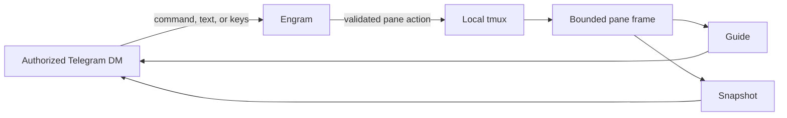

<p align="center">
  
</p>

<h1 align="center">Engram</h1>

<p align="center">
  <strong>Remote tmux, rendered as a quiet signal.</strong>
</p>

Engram is a single-user Telegram control surface for local tmux sessions. It
creates or adopts tmux panes, routes authorized Telegram input to them, and
presents each tracked session as one stable pinned message.

The pinned message can be a conversational guide or an exact terminal image.
Both derive from the same bounded pane frame. tmux remains the workspace, so
sessions continue when Engram stops or Telegram is unavailable.


```mermaid
flowchart LR
    Phone[Authorized Telegram DM]
    Engram[Engram]
    Tmux[Local tmux]
    Frame[Bounded pane frame]
    Guide[Guide]
    Snapshot[Snapshot]

    Phone -->|command, text, or keys| Engram
    Engram -->|validated pane action| Tmux
    Tmux --> Frame
    Frame --> Guide
    Frame --> Snapshot
    Guide --> Phone
    Snapshot --> Phone
```

## Choose A Presentation

| Guide | Snapshot |
| --- | --- |
| A selected model turns bounded terminal text into compact prose. Dense output is easier to scan, but the model can misunderstand it and the text leaves the host. | Local Chromium renders the bounded frame as an ANSI-preserving phone-width image. It is literal and deterministic, but the exact terminal image is uploaded to Telegram. |
| Requires Anthropic Haiku 4.5 or OpenAI Luna and its API key. Chromium is optional for one-off images. | Requires a Chromium-compatible executable. A guide provider is optional for one-off conversation. |

The current terminal frame sent to the selected guide provider is bounded but
not credential-redacted. Separately admitted agent-session history is redacted
before provider delivery, and returned model prose is redacted before
persistence or Telegram delivery.

If both are configured, `/mode guide` and `/mode snapshot` switch the pinned
presentation without changing the tmux session. See
[Configuration](docs/configuration.md) for exact settings and privacy choices.

## First Run

### 1. Install prerequisites

You need:

- Linux or macOS;
- Go 1.22 or newer;
- tmux 3.2 or newer, Git, Make, and curl;
- a Telegram account and bot; and
- either a guide provider or Chromium presentation.

Linux uses a systemd user service. macOS uses a LaunchAgent whose activation is
explicit. Both platforms can run Engram in the foreground.

Clone the repository:

```sh
git clone https://github.com/idolum-ai/engram.git
cd engram
```

### 2. Create a private Telegram bot

1. Open the verified `@BotFather` account.
2. Send `/newbot` and follow its prompts.
3. Keep the returned token private.
4. Open a direct message with the new bot and send `/start`.

Retrieve that DM from Telegram before Engram starts polling. This form keeps the
token out of shell history and the `curl` argument list:

```bash
read -rsp "Bot token: " BOT_TOKEN; printf '\n'
printf 'url = "https://api.telegram.org/bot%s/getUpdates"\n' "$BOT_TOKEN" \
  | curl --silent --show-error --config -
unset BOT_TOKEN
```

Use `message.from.id` from the private-chat update as
`TELEGRAM_ALLOWED_USER_ID`. Do not use `update_id` or the bot's own ID. The
response contains your DM text; do not paste it into an issue.

### 3. Configure Engram

Create the protected configuration:

```sh
install -d -m 0700 "$HOME/.engram"
install -m 0600 .env.example "$HOME/.engram/.env"
${EDITOR:-vi} "$HOME/.engram/.env"
```

For a guide using Anthropic:

```dotenv
TELEGRAM_BOT_TOKEN=the-token-from-BotFather
TELEGRAM_ALLOWED_USER_ID=the-message.from.id-integer
ENGRAM_ANCHOR_MODE=guide
LLM_PROVIDER=anthropic
ANTHROPIC_API_KEY=your-Anthropic-key
```

For OpenAI Luna, select `openai` and set `OPENAI_API_KEY`. For local snapshots:

```dotenv
TELEGRAM_BOT_TOKEN=the-token-from-BotFather
TELEGRAM_ALLOWED_USER_ID=the-message.from.id-integer
ENGRAM_ANCHOR_MODE=snapshot
ENGRAM_SNAPSHOT_BROWSER=/absolute/path/to/chrome-headless-shell
```

Leave `TELEGRAM_CHAT_ID` empty for the supported private-DM deployment. Engram
then uses the allowed user ID as the chat ID. The complete supported surface is
in [Configuration](docs/configuration.md).

### 4. Validate locally

Neither command calls Telegram or a model provider or starts polling:

```sh
go run ./cmd/engram preflight --env "$HOME/.engram/.env"
go run ./cmd/engram dry-start --env "$HOME/.engram/.env"
```

`preflight` is read-only. `dry-start` creates and validates local state. Confirm
that both end with `status: ok` and that tmux is not reported as missing.

### 5. Install and start

On Linux, installation preserves the systemd unit's start-on-install behavior:

```sh
make install-service PREFIX="$HOME/.local"
make service-status PREFIX="$HOME/.local"
```

On macOS, activate the LaunchAgent explicitly:

```sh
make install-service PREFIX="$HOME/.local"
make service-start PREFIX="$HOME/.local"
make service-status PREFIX="$HOME/.local"
```

Only one Engram process may poll a configured bot, user, and chat tuple or own
one `ENGRAM_HOME`. Do not run a foreground copy while the native service is
active.

### 6. Verify the first session

Send this in the bot DM:

```text
/new pwd
```

Engram creates a tmux window, runs `pwd`, and replies with the session's pinned
message. Reply to that message to send another command. Use `/status` to verify
the running Engram process and `/sessions` to list tracked work.

## Everyday Use

The common path is small:

- `/new <text>` creates a tmux window and runs one command.
- `/attach <tmux-target>` adopts an existing pane.
- Reply to a session's pinned message to run a command there.
- Reply with `//text` to send literal text without pressing Enter.
- `/sessions` lists tracked, collapsed, and lost work with controls.
- `/mode [guide|snapshot]` shows or changes the current presentation.
- `/recovery` produces an explicit plan for lost agent sessions.
- `/raw <id>` sends a bounded plain-text frame; `/dump <id>` sends retained
  scrollback.
- `/close <id>` closes an Engram-created window or only untracks an attached
  pane.

The complete list is generated from the same registry used by Telegram `/help`
and Bot API registration: [Telegram command reference](docs/telegram-commands.md).
Locally, `engram commands` emits JSON and
`engram commands --format markdown` emits the checked-in reference.
Pinned-message controls, saved input, hiding and restoring work, nested signals,
and guarded file links are covered in [Session controls](docs/session-controls.md).

## Agent Sessions

Engram can identify specifically tested Codex and Claude Code releases without
letting an unfamiliar screen change terminal behavior. Compatibility has four
independent axes: process identity, pane-local hook binding, visible screen
grammar, and historical transcript parser. Failure on one axis degrades only
the feature that depends on it.

Optional historical context is disabled by default. When enabled, Engram uses
only bounded visible user and assistant text from the exact active session.
Current facts still come from the terminal frame. Hidden reasoning, tools,
metadata, attachments, sidechains, and unknown record shapes are excluded.

See [Agent compatibility](docs/agent-compatibility.md),
[Codex session context](docs/codex-session-context.md), and
[Claude Code session context](docs/claude-code-session-context.md) for supported
versions, hooks, migration, and disclosure boundaries.

## Files And Voice

Telegram attachments enter Engram's private runtime store. Replying with a file
to a session sends its validated local path as pane input. `/download` uploads
one absolute local regular file after bounded validation. `/templates export`,
`/raw`, and `/dump` are explicit disclosure operations.

Voice replies default to `VOICE_INPUT_MODE=path`: Engram retains the OGG locally
and sends its path to the pane. `VOICE_INPUT_MODE=transcribe` sends the audio to
OpenAI once and delivers the bounded transcript instead. Voice processing is
independent of the guide provider.

Review [Data flow and privacy](docs/data-flow.md) before moving sensitive files
or enabling any provider-backed feature.

## Pane-Scoped GitHub Access

Engram can encrypt GitHub App enrollment locally and broker short-lived
installation tokens to one validated watched pane. Every request declares an
App, installation when needed, repository set, permission set, and either one
exact child command or a bounded work-session purpose and duration.

Approval lets Engram continue to installation inspection and token minting. It
does not mean GitHub accepted the scope, the child ran successfully, or a
repository changed. The token is passed only through the child environment and
is not printed or persisted.

```sh
engram github exec \
  --app idolum \
  --repo idolum-ai/engram \
  --permission contents=read \
  -- gh pr view 73
```

For a longer bounded workflow, `engram github grant` authorizes one pane-local
ceiling; later subset `github exec` requests can reuse it until expiry or
revocation. Inspect and end authority with:

```sh
engram github status
engram github revoke
```

Enrollment, unlock modes, permission eligibility, multi-installation routing,
Git transport, and troubleshooting are documented in the
[GitHub App capability guide](docs/github-app-capabilities.md).

## Operation And Recovery

Source installation and upgrade:

```sh
git pull --ff-only
make check
make install PREFIX="$HOME/.local"
make service-restart PREFIX="$HOME/.local"
make service-status PREFIX="$HOME/.local"
```

Installing a binary never restarts a running service. The restart command is
also the native service-definition migration boundary. tmux descendants remain
when Engram stops.

Use the appropriate status surface:

- Telegram `/status` verifies the running Engram application.
- `make service-status` verifies the native user service and its live process.
- `engram status --env PATH` validates configured local state without network
  calls.
- `engram inspect status` reads persisted Engram state and local tmux without
  loading Telegram or provider configuration.

After a reboot or lost pane, `/recovery` shows the deterministic plan. Engram
never replays observed commands automatically. See
[Headless operation](docs/headless-operation.md) for release installation,
foreground use, native service lifecycle, local inspection, upgrades, rollback,
uninstall, and agent-session recovery.

## Security Boundary

The authorized Telegram user can reach shell input in tmux. Treat control of
the Telegram account and bot token accordingly. Bot chats are not end-to-end
encrypted.

Guide frames, transcribed voice, snapshots, captures, downloaded files, logs,
templates, and GitHub capabilities cross different boundaries. They are never
interchangeable because they originate in one session. Read
[Data flow and privacy](docs/data-flow.md) and [Security policy](SECURITY.md)
before exposing sensitive work.

## Local Diagnostics

```sh
engram preflight --env "$HOME/.engram/.env"
engram status --env "$HOME/.engram/.env"
engram dry-start --env "$HOME/.engram/.env"
engram inspect status
engram inspect sessions
engram inspect frame 3
engram doctor agent --provider codex --pane %7
```

The `inspect` and `doctor` commands make no direct network calls and do not
mutate Engram state or tmux. Literal inspected pane content is not redacted.

## Development

Engram uses only the Go standard library. Run the full local gate before
pushing:

```sh
make check
```

Start with the [documentation index](docs/README.md), the binding
[requirements](requirements/INDEX.md), and [contribution guide](CONTRIBUTING.md).
The [product surface](docs/product-surface.md) joins each user journey to its
authority, evidence, recovery, and requirement. Live model evaluations and
hermetic end-to-end suites remain documented with their respective test
artifacts rather than in this product front door.
The manual commands and interpretation rules for those model checks are in
[Model evaluations](docs/model-evaluations.md).

## License

Engram is open source under the MIT License. See [LICENSE](LICENSE).
