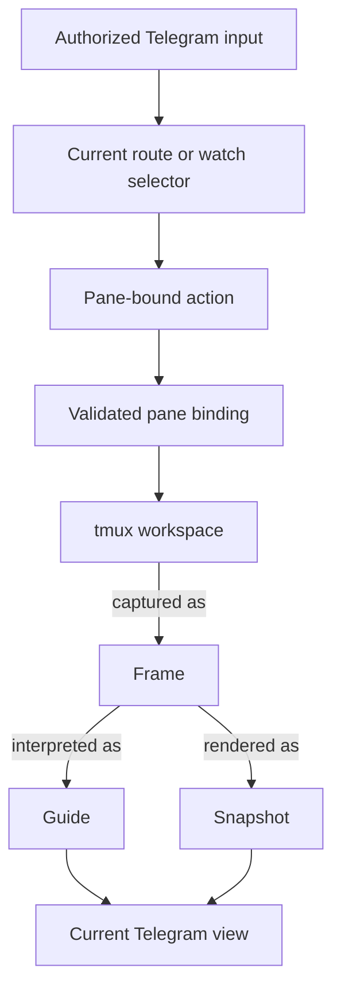
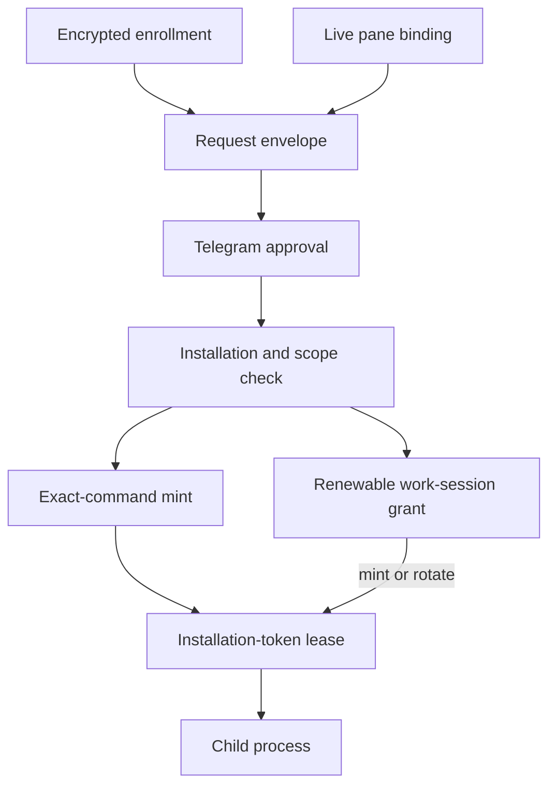

# Engram Conceptual Model

Status: descriptive. The files under
[`requirements/`](../requirements/INDEX.md) remain the binding runtime contract.

This document maps Engram's main terms and the paths that connect them.

## Terminal path

Input reaches tmux after Engram validates the selected watch and its immutable
pane identity. Presentation travels the other way: Engram captures one frame,
then produces a guide or snapshot. Telegram accepts the new message before it
becomes the current view.

## Terminal terms

| Term | Meaning |
| --- | --- |
| **Workspace** | The tmux processes, panes, and history that continue independently of Engram and Telegram. |
| **Pane binding** | The immutable tmux server, window, and pane identity checked before an action. Names and indexes are display labels. |
| **Watch** | Engram's record for a pane binding, its origin, lifecycle, presentation, and recovery state. |
| **Frame** | One bounded observation of a pane. Its styled rows and logical text share the same coordinates and capture interval. |
| **View** | The current Telegram guide or snapshot for an expanded watch. |
| **Route** | A current view, or the latest supported alternate, that can request input for its watch. |
| **Action** | Command plus Enter, literal text, validated keys, or a separately checked close operation. |

Snapshots render the frame's physical rows. Guides interpret its logical text.
Optional history may help a guide recover the topic, but present terminal facts
still come from the frame. Engram computes identities, paths, timestamps,
links, hashes, process facts, and geometry locally.

## GitHub access path

The request names one App, installation, pane, repository set, and permission
set. It also names either one command or a bounded duration and purpose.
Approval lets Engram continue. GitHub still has to accept the requested scope
and return a matching token before Engram can start the child.

## GitHub terms

| Term | Meaning |
| --- | --- |
| **Credential** | The GitHub App private key used to authenticate as the App. |
| **Enrollment** | An encrypted record containing the App identity, installation set, fingerprint, unlock mode, generation, and credential. |
| **Request envelope** | The App, installation, repositories, permissions, pane, and command or work-session boundary presented for approval. |
| **Approval** | The authorized Telegram user's single-use decision over that exact envelope. |
| **Renewable grant** | Process-local permission to mint tokens within one approved App, installation, pane, repository, permission, purpose, and time limit. |
| **Token lease** | The current scoped bearer token held in Engram memory until expiry or invalidation. |
| **Child process** | The approved command that receives the token and is trusted to use it within the requested workflow. |

The credential unlock route does not change the requested GitHub scope:

| Unlock route | Credential source |
| --- | --- |
| **Local** | A passphrase entered in the requesting terminal. |
| **Telegram** | A passphrase sent through the explicitly enabled Telegram reply flow. |
| **Approval-only** | A separate owner-only device seal read after approval. |
| **Configured PEM** | A live owner-only PEM whose identity and fingerprint are rechecked during the request. |

A token minted for an exact command may serve later same-pane subset commands
while its pane and enrollment still match. A renewable grant may mint or rotate
tokens until its fixed expiry. Each child under a grant receives a token at the
full approved grant ceiling.

## Distinctions to preserve

| Keep separate | Reason |
| --- | --- |
| tmux state and a frame | A frame covers one bounded interval. |
| a frame and a guide | A guide interprets the frame and can be wrong. |
| a watch and a pane | A watch also carries origin, lifecycle, delivery, and recovery state. |
| a Telegram message and a route | A message may remain visible after its route becomes stale. |
| a model proposal and an action | Keys require local validation and, when applicable, confirmation. |
| historical context and current observation | History supplies topic, while the current frame supplies terminal facts. |
| a source PEM and an enrollment | The encrypted enrollment has its own identity and lifecycle. |
| approval and GitHub acceptance | GitHub may reject the installation, repository, or permission scope. |
| a renewable grant and a token | The grant permits bounded minting; the token is the shorter-lived bearer credential. |
| a token and a successful outcome | Token delivery says nothing about what the child later achieves. |

## Failures stay specific

GitHub request rejection, denied approval, failed unlock, changed enrollment,
scope rejection, failed minting, canceled delivery, child failure, and failed
remote revocation occur at different stages. Engram reports the stage that
failed and removes any local authority created after it.

The terminal path follows the same rule. Capture, guide, render, Telegram
delivery, and pane loss have different consequences. Failure at one stage does
not imply failure or success at another.
