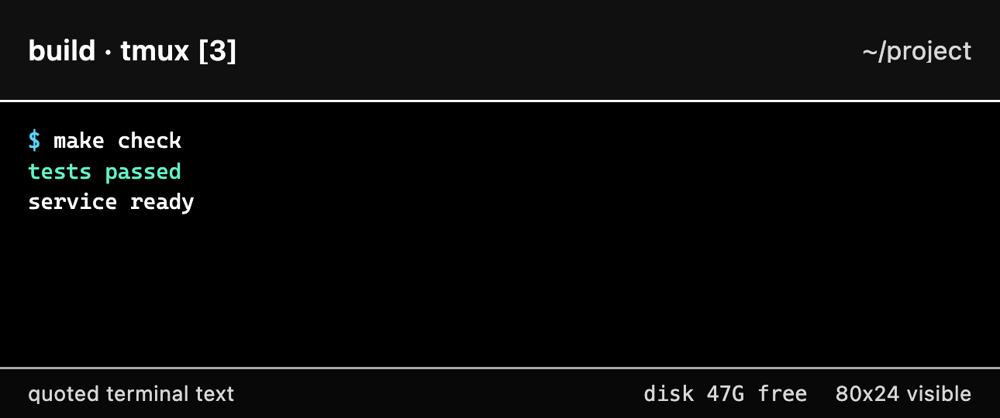

# Configuration

Engram reads a protected `KEY=VALUE` file. The default is
`~/.engram/.env`; `make run` uses that path unless `ENGRAM_ENV` selects another
file. The file must be regular, owned by the current user, and inaccessible to
group and other users.

Start from the tracked example:

```sh
install -d -m 0700 "$HOME/.engram"
install -m 0600 .env.example "$HOME/.engram/.env"
${EDITOR:-vi} "$HOME/.engram/.env"
```

The repository ignores only its root `.env`. Prefer the file under
`~/.engram`; never place an alternate secret file in the checkout.

## Settings

The table below and `.env.example` are checked for exact key parity by
`make docs-freshness`.

<!-- config-table:start -->
| Setting | Default | Required | Purpose |
| --- | --- | --- | --- |
| `TELEGRAM_BOT_TOKEN` | none | yes, secret | Token issued by `@BotFather`. Treat it as access to the Engram control channel. |
| `TELEGRAM_API_BASE` | `https://api.telegram.org` | no | Telegram Bot API server root. Engram appends `/bot<token>` and `/file/bot<token>`. HTTP is accepted for local servers but exposes credentials and content in transit. |
| `TELEGRAM_ALLOWED_USER_ID` | none | yes | The one Telegram user ID allowed to issue commands. |
| `TELEGRAM_CHAT_ID` | allowed user ID | no | The one allowed chat. Leave empty for a private DM; group operation is unsupported. |
| `TELEGRAM_POLL_TIMEOUT_SECONDS` | `50` | no | Positive Telegram long-poll timeout in seconds. |
| `ENGRAM_ANCHOR_MODE` | `guide` | no | Startup presentation and fallback: conversational `guide` or Chromium `snapshot`. A usable choice made with `/mode` persists across restarts. |
| `ENGRAM_CODEX_CONTEXT_TURNS` | `0` | no | Privacy opt-in (`0` disables; maximum `8`) for recent visible messages from the exactly identified active Codex session. |
| `ENGRAM_CLAUDE_CONTEXT_TURNS` | `0` | no | Separate privacy opt-in (`0` disables; maximum `8`) for recent visible messages from the exactly identified active Claude Code session. |
| `LLM_PROVIDER` | `anthropic` | when enabling a guide | `anthropic` for Haiku 4.5 or `openai` for Luna. Changing it requires a restart. |
| `ANTHROPIC_API_KEY` | none | when selecting Anthropic, secret | Credential for one-pass Haiku rendering. |
| `ANTHROPIC_MODEL` | `claude-haiku-4-5-20251001` | no | Haiku model ID; the `claude-haiku-4-5` alias is also accepted. |
| `OPENAI_API_KEY` | none | when selecting OpenAI or transcription, secret | Credential for one-pass Luna rendering and, when explicitly selected, voice transcription. |
| `OPENAI_MODEL` | `gpt-5.6-luna` | no | Luna model ID. Other OpenAI guide models are not admitted by this release. |
| `VOICE_INPUT_MODE` | `path` | no | Replied voice-note handling: retain locally and send its absolute `path`, or `transcribe` through OpenAI. Changing it requires a restart. |
| `OPENAI_TRANSCRIPTION_MODEL` | `gpt-4o-transcribe` | no | Assessed speech-to-text model used only by `VOICE_INPUT_MODE=transcribe`. |
| `ENGRAM_HOME` | `~/.engram` | no | State, remembered input templates, GitHub enrollment, audit log, and process-lock directory. |
| `ENGRAM_WORKDIR` | `~` | no | Starting directory for new tmux sessions and windows. |
| `ENGRAM_TMUX_SESSION` | first existing session, otherwise `engram-<chat-id>` | no | Forces one exact tmux session name and creates it when absent. `:` and `.` are unsupported because tmux canonicalizes them. |
| `ENGRAM_TMUX_SIZE` | `100x48` | no | Stable `COLUMNSxROWS` geometry for new Engram windows. Each dimension must be between 1 and 400. |
| `ENGRAM_SNAPSHOT_BROWSER` | auto-detected headless shell, with Linux fallbacks | when enabling snapshots | Executable name or absolute path used for terminal images. macOS auto-detection accepts dedicated headless executables only. |
| `ENGRAM_SNAPSHOT_THEME` | `terminal` | no | Snapshot colors: faithful `terminal`, accessible `contrast-dark`, or accessible `contrast-light`. |
| `ENGRAM_SNAPSHOT_STATUS_COMMAND` | none | no | Trusted local shell command whose sanitized one-line output occupies a bounded snapshot-footer slot. |
| `ENGRAM_ATTACHMENT_SOFT_MAX_BYTES` | `16777216` | no | Incoming attachment soft limit. An exact SHA-256 bypass may authorize up to the 20 MiB cloud Bot API hard limit and available disk. |
| `ENGRAM_GITHUB_GRANT_MAX_DURATION` | `8h` | no | Maximum approved lifetime for a process-local renewable GitHub grant. It must be positive and no greater than 24 hours. |
| `ENGRAM_GITHUB_APP_PEM_ALIAS` | none | no | Alias of the one enrollment selected for configured local PEM unlock. Set with `ENGRAM_GITHUB_APP_PEM_PATH`; changing either requires a restart. |
| `ENGRAM_GITHUB_APP_PEM_PATH` | none | no, secret file path | Absolute path of the live PEM for `ENGRAM_GITHUB_APP_PEM_ALIAS`. Engram validates it at every approval or use boundary. |
<!-- config-table:end -->

`TELEGRAM_GROUP_CHAT_ID` remains a read-only compatibility alias for old
configurations. It is not part of the supported configuration surface. Migrate
it to `TELEGRAM_CHAT_ID`.

## Presentation Choices

Guide mode requires the selected model provider and its API key. It sends a
bounded pane frame to that provider and returns a compact interpretation.
The current terminal frame sent to the selected guide provider is bounded but not
credential-redacted. Separately admitted agent-session history is redacted
before provider delivery, and returned model prose is redacted before
persistence or Telegram delivery. Snapshot mode requires a local
Chromium-compatible executable and sends the rendered image to Telegram. If
both capabilities are available, `/mode guide` and `/mode snapshot` switch the
current presentation and persist the choice.

On macOS, use the standalone `chrome-headless-shell` from
[Chrome for Testing](https://googlechromelabs.github.io/chrome-for-testing/).
Engram does not download or update it. Desktop Chrome and Chromium applications
are excluded from automatic detection; an explicit path opts into them.

## Voice Input

`VOICE_INPUT_MODE=path` keeps a Telegram voice note in Engram's private
attachment store and sends its absolute path as literal pane input.
`VOICE_INPUT_MODE=transcribe` sends the audio once to OpenAI and sends the
bounded transcript instead. The voice mode is independent of the guide
provider.

## Agent Context

Codex and Claude Code history are separate, disabled-by-default inputs. Enabling
one turn limit does not identify a session by itself. Engram still requires the
documented pane-local hook binding, current process identity, exact transcript,
supported parser, redaction, and byte limits. See
[Agent compatibility](agent-compatibility.md),
[Codex session context](codex-session-context.md), and
[Claude Code session context](claude-code-session-context.md).

## Local Snapshot Status

A snapshot footer may carry one bounded fact computed by the host. For example:

```env
ENGRAM_SNAPSHOT_STATUS_COMMAND=df -kP . | awk 'END {printf "disk %.1fG free\n", $4 / 1048576}'
```



This is a trusted local `/bin/sh` command from the protected configuration, not
a command derived from terminal text, Telegram, or model output. It runs only
when an image is already being rendered, with a 500 ms deadline, bounded
stdout, discarded stderr, and a reduced environment that excludes configured
credentials. Failure omits the footer without failing the image.

## Validate Before Starting

These commands load the configuration without calling Telegram or a model
provider and without starting polling:

```sh
engram preflight --env "$HOME/.engram/.env"
engram dry-start --env "$HOME/.engram/.env"
```

`preflight` is read-only. `dry-start` also creates and validates the private
state surfaces used at startup. Both must end with `status: ok`.
